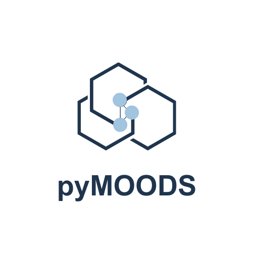

<div align="center">
  <div style="margin: -40px 0 -50px 0;">
    
  </div>

  <div style="margin-bottom: 20px;">
    
    
    
    
  </div>
  <p align="center">
    A Visualization Framework for Multi-Criteria Decision Making
  </p>
</div>

## Overview
An AI-enabled visualization capability for power systems planning that integrates co-design principles. The goal is to create a platform that combines cutting-edge artificial intelligence with interactive visualizations and theory of multi-criteria decision-making (MCDM) to address key challenges in large-scale infrastructure planning and operations. This tool will help stakeholders collaborate more effectively, enabling better decision-making by exploring complex scenarios in real time.

## Key Features
✅ Interactive Visualization of High-Dimensional Pareto Fronts\
✅ Plug-and-Play Data-Driven Framework\
✅ Scenario Comparison & Tradeoff Analysis\
✅ Customizable Decision Criteria & Constraints\
✅ Pre-Integrated Real-World Use Cases\
🚀 Coming Soon: Generative AI-Powered Interaction

## Installation

Install pyMOODS via pip:

```bash
# Coming soon on pip
```

For development installation:

```bash
git clone https://github.com/pymoods/pymoods.git
cd pymoods
pip install -e .
```

## Documentation
Work in progress.
<!-- Full documentation is available at [https://pymoods.readthedocs.io](https://pymoods.readthedocs.io), including:

- API reference
- Tutorials and examples
- Contribution guidelines
- Theory and methodology -->

## Quick Start

```python
# To be filled
```

## Contributing

We welcome contributions from the community! Please see our [Contribution Guidelines](CONTRIBUTING.md) for details on how to:

- Report issues
- Submit pull requests
- Suggest new features
- Improve documentation

## License

pyMOODS is released under the MIT License. See [LICENSE](LICENSE) for full details.

## Citation

If you use pyMOODS in your research, please cite:

```bibtex
@software{pymoods,
  title = {pyMOODS: Multi-Objective Optimization and Decision Support},
  author = {pyMOODS Contributors},
  year = {2023},
  publisher = {GitLab},
  journal = {GitLab repository},
}
```

## Contact

For questions or support, please open an issue on GitHub or contact the project PI Dr. Milan Jain at [milan.jain@pnnl.gov](mailto:milan.jain@pnnl.gov).