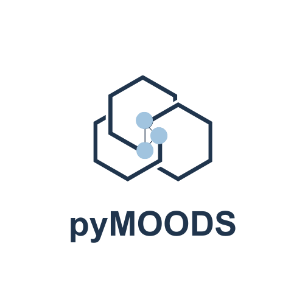

<div align="center">
  <div style="margin: -40px 0 -50px 0;">
    
  </div>
  <p align="center">
    A Visualization Framework for Multi-Criteria Decision Making
  </p>
  <div style="margin-bottom: 20px;">
    
  </div>
</div>

[](https://doi.org/10.5281/zenodo.22882257)

## Overview
A visualization dashboard for power systems planning that integrates co-design principles. The goal is to create a machine learning supported platform that combines interactive visualizations and theory of multi-criteria decision-making (MCDM) to address key challenges in large-scale infrastructure planning and operations. This tool will help stakeholders collaborate more effectively, enabling better decision-making by exploring complex scenarios in real time.

## Quick Start

### Prerequisites
- python
- venv
- yarn
- node
- Git LFS

Please run `git lfs install` in your terminal before cloning the repository. This is necessary as our data files utilize Git LFS.

### Starting the API Server

1. Create a virtual environment if this is your first time running. Activate your virtual environment using the following command:

```bash
./venv/Scripts/activate
```

2. Install the dependencies for your venv:

```bash
pip install -r requirements.txt
```

3. Run the following command to start the API server:

```bash
cd dashboard/backend/api
python react_api.py
```

The API should be running on `http://localhost:8080`

#### Starting the React App (Client)

1. Navigate to the frontend directory

```bash
cd dashboard/frontend
```

2. Run the following to install the dependencies:

```bash
yarn install
```

2. Run the following to start the development server:

```bash
yarn start
```

You can now access the React app on `http://localhost:3000`.

## Contributing

We welcome contributions from the community! Please see our [Contribution Guidelines](docs/CONTRIBUTING.md) for details on how to:

- Report issues
- Submit pull requests
- Suggest new features
- Improve documentation

## License

pyMOODS is released under the [BSD-3-Clause License](LICENSE.txt)

## Contact

For questions or support, please open an issue on GitLab or contact the project PI Dr. Milan Jain at [milan.jain@pnnl.gov](mailto:milan.jain@pnnl.gov).