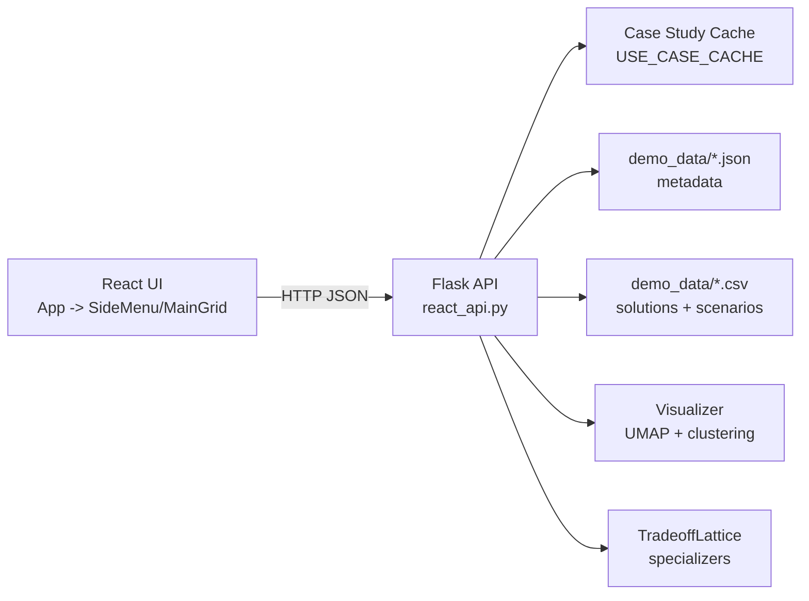
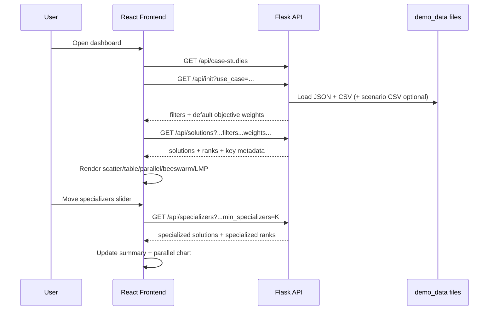

# Dashboard Developer Guide

This document explains how the dashboard is implemented, how data moves through the system, and how to safely extend it.

## 1. Scope

The dashboard combines:

- A Flask backend API in `dashboard/backend/api`.
- A React + TypeScript frontend in `dashboard/frontend`.
- Domain-specific projection and clustering utilities in `dashboard/dashlib/offshore_windfarm/vis.py`.
- Use-case metadata and data files in `dashboard/demo_data`.

Primary runtime entry points:

- Backend: `dashboard/backend/api/react_api.py` (port `8080` by default).
- Frontend: `dashboard/frontend` Vite app (port `3000` by default).

## 2. High-Level Architecture



## 3. Repository Map (Dashboard Area)

- `dashboard/backend/api/react_api.py`
  - Main backend API used by the React app.
- `dashboard/backend/api/app.py`
  - Older API variant with overlapping routes; not the active frontend target.
- `dashboard/frontend/src/App.tsx`
  - Top-level shell and shared state for selected use case, filters, and weights.
- `dashboard/frontend/src/components/SideMenu.tsx`
  - Use case selection, filter controls, and objective weight controls.
- `dashboard/frontend/src/components/MainGrid.tsx`
  - Main orchestration layer for fetching data and composing all visual panels.
- `dashboard/frontend/src/components/OffshoreWindfarmPlots/*`
  - Plot and table components.
- `dashboard/demo_data/*.json`
  - Per-use-case metadata and file pointers.
- `dashboard/demo_data/*.csv`
  - Solution/scenario datasets.

## 4. Backend Implementation

### 4.1 App Setup and Cache

`react_api.py` configures Flask + CORS and defines a global in-memory cache:

- `USE_CASE_CACHE: Dict[str, dict]`
- Populated by `load_case_study_data(case_study_name)`.

The cache entry contains:

- `hyperparameters`
- `input_parameters`
- `objective_functions`
- `decision_variables`
- `csv_data` (main solution table)
- `scenario_data` (optional time-series table)

`/api/init` is the canonical initialization call that loads a use case and returns:

- Sidebar filter metadata (`filters`)
- Default objective weights (`objectives`)

### 4.2 Data Loading Contract

Each case study JSON in `dashboard/demo_data` is expected to include:

- `datafile`: CSV file name for solutions.
- Optional `scenariofile`: CSV file name for scenario/LMP-like series.
- `hyperparameters`: keys used for frontend filters.
- `objective_functions`: objective columns.
- `decision_variables`: decision columns.

Example pattern (from existing files):

- `Cameo_datacenter.json` points to `parsed_datacenter_data.csv`.
- `MoCoDo_v3.json` points to `design_solutions.csv` and `scenarios.csv`.

### 4.3 Projection/Clustering Pipeline

The API uses `Visualizer` from `dashboard/dashlib/offshore_windfarm/vis.py`:

- Builds embeddings using UMAP.
- Produces cluster labels and projection coordinates.
- Exposes `joint_xy` and `df_clustered` used by API handlers.

For specializer analysis, `/api/specializers` uses `TradeoffLattice` (imported from `notebooks/tradeoff_lattice.py`) to compute specialization rows from ranked objectives.

### 4.4 API Endpoint Reference

#### Discovery and initialization

- `GET /api/case-studies`
  - Lists available use case JSON basenames from `demo_data`.
- `GET /api/init?use_case=<name>`
  - Loads/caches use case and returns filter options + default objective weights.

#### Core solution and scoring APIs

- `GET /api/solutions?use_case=<name>&<filters...>&weight_<objective>=<number>`
  - Applies hyperparameter filters.
  - Computes weighted sum across objective columns.
  - Adds projection (`x_coord`, `y_coord`) and cluster label (`label`) fields.
  - Returns `solutions`, `ranks`, and key groups for frontend column ordering.

- `GET /api/objective?use_case=<name>&<filters...>&weights=<json>`
  - Returns weighted mean score and weights used.
  - Frontend also uses this route to discover objective keys.

- `GET /api/objective-plot-data?use_case=<name>&<filters...>&weight_<objective>=<number>`
  - Returns distributions and selected values for objective and decision variables.

#### Plot-specific APIs

- `GET /api/scatterplot?use_case=<name>&<filters...>&color_by=<col>&weights=<json>`
  - Returns Plotly scatter JSON and plot config.
- `GET /api/decision?use_case=<name>&<filters...>`
  - Returns Plotly histogram stack JSON.
- `GET /api/decision_space?use_case=<name>&<filters...>`
  - Returns Plotly decision-space distribution JSON.
- `GET /api/lmp?use_case=<name>&<filters...>`
  - Returns scenario records if `scenariofile` exists, else empty list.

#### Specialization API

- `GET /api/specializers?use_case=<name>&min_specializers=<int>&<filters...>&weight_<objective>=<number>`
  - Filters data.
  - Computes specializers via `TradeoffLattice`.
  - Returns a reduced solution table + rank data + specialization metadata.

#### Legacy/migration route

- `POST /api/project`
  - Accepts selected solution rows and returns projection arrays.
  - Designed for older frontend flow (`ClusterScatterPlot.tsx`), currently not used by `MainGrid.tsx`.

## 5. Frontend Implementation

### 5.1 Root State (`App.tsx`)

Top-level state includes:

- `selectedUseCase`
- `filters: Record<string, string[]>`
- `weights: Record<string, number>`
- `isDataLoaded`

`App.tsx` composes:

- `SideMenu` (left pane)
- `AppNavbar`
- `MainGrid` (main content)

### 5.2 Side Menu (`SideMenu.tsx`)

Lifecycle:

1. On mount, fetches `/api/case-studies` and selects a default use case.
2. On use-case change, fetches `/api/init`.
3. Initializes empty filter arrays for all returned filter keys.
4. Initializes objective weight controls from `/api/init.objectives`.
5. Sends updates to parent through callbacks.

### 5.3 Main Data Orchestration (`MainGrid.tsx`)

`MainGrid.tsx` performs a unified fetch to `/api/solutions` whenever use case, filters, or weights change.

It derives:

- `summaryData` for the table.
- `rankData` for the parallel coordinates chart.
- `radarData` (objective/decision distributions) for beeswarm views.
- `completeData` for scatter plot and cross-panel selection.

It also integrates the specializer workflow:

- `ParallelCoordinatesChart` slider calls `/api/specializers`.
- Returned data can replace table/rank content to show specialized-only sets.

### 5.4 Key Visual Components

- `ScatterPlot.tsx`
  - Uses `react-plotly.js`.
  - Builds grouped traces from `solutionsData` by `label`.
  - Supports dynamic X/Y axis field selection and rich hover tooltips.

- `ParallelCoordinatesChart.tsx`
  - Uses D3 on SVG.
  - Computes per-objective rank columns and draws polyline paths.
  - Contains a slider UI that triggers `/api/specializers`.

- `Summary.tsx`
  - MUI table with sticky header and numeric sort toggling.
  - Clicking a row sends location selection back to parent for cross-filtering.

- `LMPPlot.tsx`
  - Uses D3 line rendering for scenario time series.
  - Supports selecting numeric scenario columns and line hover tooltips.

- `DualRadarChart.tsx` + `BeeSwarm.tsx`
  - Two beeswarm/violin-style panels:
    - Objective functions
    - Decision variables
  - Uses distribution arrays and highlighted selected values.

### 5.5 Config and API Base URL

- Frontend API base URL is centralized in `frontend/src/config.ts`.
- Default is local `http://127.0.0.1:8080`.

## 6. End-to-End Data Flow



## 7. Data Expectations

### 7.1 Use Case JSON

Required fields:

- `datafile`
- `hyperparameters`
- `objective_functions`
- `decision_variables`

Optional:

- `scenariofile`
- `input_parameters`

### 7.2 Solution CSV

Must include columns referenced by:

- Hyperparameters (`hyperparameters` keys)
- Objectives (`objective_functions` keys)
- Decisions (`decision_variables` keys)

### 7.3 Scenario CSV (Optional)

For LMP/scenario charting, existing files use columns like:

- `sim`, `time`
- one or more numeric metric columns (for dropdown selection)
- contextual fields such as `Case Study`, `Location`

## 8. Testing and Validation

Frontend end-to-end tests are in `dashboard/frontend/tests/dashboard.spec.ts`.

Current test strategy:

- Playwright intercepts/mocks API routes.
- Tests verify:
  - Core sections render.
  - Summary table sorting behavior.
  - Specializers slider updates UI state.

Playwright config (`frontend/playwright.config.ts`) runs against the local Vite server at `127.0.0.1:3000`.

## 9. Runbook for Local Development

### Backend

1. Create and activate a Python environment from `dashboard`.
2. Install dependencies from `dashboard/requirements.txt`.
3. Run:

```bash
cd dashboard/backend/api
python react_api.py
```

### Frontend

1. Open another terminal:

```bash
cd dashboard/frontend
yarn install
yarn start
```

2. Open `http://127.0.0.1:3000`.

## 10. Extension Patterns

### 10.1 Add a New Use Case

1. Add `<name>.json` in `dashboard/demo_data` with required metadata keys.
2. Add referenced solution CSV and optional scenario CSV in `dashboard/demo_data`.
3. Confirm objective/decision/hyperparameter keys match CSV columns.
4. Start backend and verify:
   - `/api/case-studies` contains your new name.
   - `/api/init?use_case=<name>` returns expected filters/objectives.

### 10.2 Add a New Visualization

1. Implement backend data endpoint in `react_api.py` returning JSON (or Plotly JSON string).
2. Build a frontend component (template exists: `NewPlotTemplate.tsx`).
3. Connect component in `MainGrid.tsx` and pass the shared `useCase/filters/weights` state as needed.
4. Add or extend Playwright tests to validate rendering and interactions.

## 11. Implementation Notes and Technical Debt

- `backend/api/app.py` and `backend/api/react_api.py` both expose API routes; `react_api.py` is the active implementation for the current React UI.
- Several plot components exist but are not mounted in `MainGrid.tsx` (for example `ClusterScatterPlot.tsx`, `DecisionPlot.tsx`, and `ObjectivePlot.tsx`).
- The `/api/project` endpoint supports legacy cluster-scatter behavior and is not part of the current primary view composition.
- Some frontend files contain debug `console.log` statements that may be noisy in production.

---

If you update endpoint signatures or cross-panel interaction behavior, update this document in the same PR so backend/frontend contracts remain synchronized.