## Example Case Study: MoCoDo 2024 Formulation
- **Base:** Setting ESS rated power $sz^E$ to be 2% of OWF rated power; fixing $k^{ResB}$ and $k^{ResW}$ at their upper limits for providing maximum frequency support; using one or more HVDC cables with fixed rated power of 2600 MW; 3% inflation; data of 2018
- **CCD18-3**, **CCD18-5**, and **CCD18-8**: CCD model with 3%, 5%, and 8% reflation rate; data of 2018
- **CCD22-3**, **CCD22-5**, and **CCD22-8**: CCD model with 3%, 5%, and 8% reflation rate; data of 2022
- **No reserve**: Same as CCD18-3 case, but no reserve is provided for frequency support
- **No ESS**: Same as CCD18-3 case, but no ESS installed

#### Terminologies:
- $sz^E$: Rated power of ESS
- $k^{ResB}$: Droop control parameters of ESS
- $k^{ResW}$: Droop control parameters of OWF
- Reflection rate: Quantifies how much of the transmitted power is reflected back towards the source due to impedance mismatches in the system.

<table border="1" class="dataframe">
  <thead>
    <tr style="text-align: right;">
      <th></th>
      <th></th>
      <th>Cable Capacity(MW)</th>
      <th>Battery Rated Power(MW)</th>
      <th>Cable Material Cost($M)</th>
      <th>Battery Cost($M)</th>
      <th>Day-Ahead Revenue ($k)</th>
      <th>Real-Time Revenue ($k)</th>
      <th>Reserve WF Revenue ($k)</th>
      <th>Reserve ESS Revenue ($k)</th>
    </tr>
    <tr>
      <th>Use Case</th>
      <th>Location</th>
      <th></th>
      <th></th>
      <th></th>
      <th></th>
      <th></th>
      <th></th>
      <th></th>
      <th></th>
    </tr>
  </thead>
  <tbody>
    <tr>
      <th rowspan="5" valign="top">Base</th>
      <th>COTTONWOOD</th>
      <td>2600.000000</td>
      <td>36.200000</td>
      <td>261.818246</td>
      <td>32.184081</td>
      <td>1040.759934</td>
      <td>29.040111</td>
      <td>2.529768</td>
      <td>0.738513</td>
    </tr>
    <tr>
      <th>JOHNDAY</th>
      <td>2600.000000</td>
      <td>47.000000</td>
      <td>358.915986</td>
      <td>41.785961</td>
      <td>1303.210991</td>
      <td>45.328622</td>
      <td>3.192498</td>
      <td>0.959951</td>
    </tr>
    <tr>
      <th>MOSSLAND</th>
      <td>2600.000000</td>
      <td>36.000000</td>
      <td>533.607121</td>
      <td>32.006268</td>
      <td>919.337641</td>
      <td>28.506600</td>
      <td>2.244915</td>
      <td>0.733595</td>
    </tr>
    <tr>
      <th>TESLA</th>
      <td>5200.000000</td>
      <td>52.800000</td>
      <td>974.931412</td>
      <td>46.942526</td>
      <td>1422.478138</td>
      <td>49.483370</td>
      <td>3.473485</td>
      <td>1.084099</td>
    </tr>
    <tr>
      <th>WCASCADE</th>
      <td>2600.000000</td>
      <td>30.000000</td>
      <td>440.190421</td>
      <td>26.671890</td>
      <td>876.802486</td>
      <td>25.572794</td>
      <td>2.081571</td>
      <td>0.605057</td>
    </tr>
    <tr>
      <th rowspan="5" valign="top">No ESS</th>
      <th>COTTONWOOD</th>
      <td>1991.001203</td>
      <td>0.000000</td>
      <td>200.492478</td>
      <td>0.000000</td>
      <td>1068.932503</td>
      <td>19.655535</td>
      <td>1.278009</td>
      <td>0.000000</td>
    </tr>
    <tr>
      <th>JOHNDAY</th>
      <td>2585.000202</td>
      <td>0.000000</td>
      <td>356.845345</td>
      <td>0.000000</td>
      <td>1338.568265</td>
      <td>32.860630</td>
      <td>1.618871</td>
      <td>0.000000</td>
    </tr>
    <tr>
      <th>MOSSLAND</th>
      <td>1980.000054</td>
      <td>0.000000</td>
      <td>406.362357</td>
      <td>0.000000</td>
      <td>944.294322</td>
      <td>19.417396</td>
      <td>1.144392</td>
      <td>0.000000</td>
    </tr>
    <tr>
      <th>TESLA</th>
      <td>2904.000009</td>
      <td>0.000000</td>
      <td>544.461698</td>
      <td>0.000000</td>
      <td>1459.967335</td>
      <td>36.666428</td>
      <td>1.762601</td>
      <td>0.000000</td>
    </tr>
    <tr>
      <th>WCASCADE</th>
      <td>1650.001811</td>
      <td>0.000000</td>
      <td>279.351920</td>
      <td>0.000000</td>
      <td>899.138883</td>
      <td>19.083300</td>
      <td>1.050217</td>
      <td>0.000000</td>
    </tr>
    <tr>
      <th rowspan="5" valign="top">No Reserve</th>
      <th>COTTONWOOD</th>
      <td>1991.000362</td>
      <td>0.015596</td>
      <td>200.492393</td>
      <td>0.013866</td>
      <td>1097.701674</td>
      <td>12.840419</td>
      <td>0.000000</td>
      <td>0.000000</td>
    </tr>
    <tr>
      <th>JOHNDAY</th>
      <td>2585.000076</td>
      <td>0.002795</td>
      <td>356.845328</td>
      <td>0.002485</td>
      <td>1374.486325</td>
      <td>24.106946</td>
      <td>0.000000</td>
      <td>0.000000</td>
    </tr>
    <tr>
      <th>MOSSLAND</th>
      <td>1980.000015</td>
      <td>0.002201</td>
      <td>406.362349</td>
      <td>0.001957</td>
      <td>969.520152</td>
      <td>13.337627</td>
      <td>0.000000</td>
      <td>0.000000</td>
    </tr>
    <tr>
      <th>TESLA</th>
      <td>2904.000016</td>
      <td>0.001348</td>
      <td>544.461699</td>
      <td>0.001199</td>
      <td>1497.638549</td>
      <td>28.383188</td>
      <td>0.000000</td>
      <td>0.000000</td>
    </tr>
    <tr>
      <th>WCASCADE</th>
      <td>1650.000131</td>
      <td>0.008876</td>
      <td>279.351636</td>
      <td>0.007891</td>
      <td>922.240078</td>
      <td>14.394331</td>
      <td>0.000000</td>
      <td>0.000000</td>
    </tr>
    <tr>
      <th rowspan="5" valign="top">CCD18_3</th>
      <th>COTTONWOOD</th>
      <td>1991.029248</td>
      <td>54.300003</td>
      <td>200.495302</td>
      <td>48.276124</td>
      <td>1087.482856</td>
      <td>19.060969</td>
      <td>0.512244</td>
      <td>1.076973</td>
    </tr>
    <tr>
      <th>JOHNDAY</th>
      <td>2585.009992</td>
      <td>70.499999</td>
      <td>356.846697</td>
      <td>62.678940</td>
      <td>1360.725359</td>
      <td>33.620576</td>
      <td>0.651006</td>
      <td>1.396229</td>
    </tr>
    <tr>
      <th>MOSSLAND</th>
      <td>1980.003137</td>
      <td>53.999993</td>
      <td>406.362990</td>
      <td>48.009396</td>
      <td>960.079498</td>
      <td>20.165528</td>
      <td>0.456483</td>
      <td>1.062219</td>
    </tr>
    <tr>
      <th>TESLA</th>
      <td>2904.001129</td>
      <td>79.200000</td>
      <td>544.461908</td>
      <td>70.413789</td>
      <td>1482.503741</td>
      <td>39.052081</td>
      <td>0.712933</td>
      <td>1.571818</td>
    </tr>
    <tr>
      <th>WCASCADE</th>
      <td>1650.006081</td>
      <td>45.000000</td>
      <td>279.352643</td>
      <td>40.007835</td>
      <td>914.059737</td>
      <td>19.081562</td>
      <td>0.420015</td>
      <td>0.879943</td>
    </tr>
    <tr>
      <th rowspan="5" valign="top">CCD18_5</th>
      <th>COTTONWOOD</th>
      <td>1991.037056</td>
      <td>54.299998</td>
      <td>200.496088</td>
      <td>48.276120</td>
      <td>1087.483511</td>
      <td>19.075074</td>
      <td>0.512198</td>
      <td>1.077032</td>
    </tr>
    <tr>
      <th>JOHNDAY</th>
      <td>2585.013157</td>
      <td>70.499883</td>
      <td>356.847134</td>
      <td>62.678838</td>
      <td>1360.718541</td>
      <td>33.635886</td>
      <td>0.650982</td>
      <td>1.396232</td>
    </tr>
    <tr>
      <th>MOSSLAND</th>
      <td>1980.001935</td>
      <td>53.996802</td>
      <td>406.362743</td>
      <td>48.006559</td>
      <td>960.067633</td>
      <td>20.168893</td>
      <td>0.456511</td>
      <td>1.062129</td>
    </tr>
    <tr>
      <th>TESLA</th>
      <td>2904.001711</td>
      <td>79.199999</td>
      <td>544.462017</td>
      <td>70.413788</td>
      <td>1482.507440</td>
      <td>39.053982</td>
      <td>0.712933</td>
      <td>1.571801</td>
    </tr>
    <tr>
      <th>WCASCADE</th>
      <td>1650.007926</td>
      <td>44.999968</td>
      <td>279.352955</td>
      <td>40.007807</td>
      <td>914.055014</td>
      <td>19.087459</td>
      <td>0.420010</td>
      <td>0.879933</td>
    </tr>
    <tr>
      <th rowspan="5" valign="top">CCD18_8</th>
      <th>COTTONWOOD</th>
      <td>1991.058035</td>
      <td>52.534622</td>
      <td>200.498201</td>
      <td>46.706589</td>
      <td>1087.039378</td>
      <td>19.104879</td>
      <td>0.530458</td>
      <td>1.042701</td>
    </tr>
    <tr>
      <th>JOHNDAY</th>
      <td>2584.999080</td>
      <td>61.202332</td>
      <td>356.845190</td>
      <td>54.412729</td>
      <td>1358.533444</td>
      <td>33.588266</td>
      <td>0.743821</td>
      <td>1.216083</td>
    </tr>
    <tr>
      <th>MOSSLAND</th>
      <td>1979.998289</td>
      <td>39.936632</td>
      <td>406.361995</td>
      <td>35.506182</td>
      <td>956.963027</td>
      <td>20.104168</td>
      <td>0.582234</td>
      <td>0.791503</td>
    </tr>
    <tr>
      <th>TESLA</th>
      <td>2904.008432</td>
      <td>65.888878</td>
      <td>544.463277</td>
      <td>58.579363</td>
      <td>1479.893389</td>
      <td>38.585057</td>
      <td>0.835775</td>
      <td>1.315676</td>
    </tr>
    <tr>
      <th>WCASCADE</th>
      <td>1650.023596</td>
      <td>40.079054</td>
      <td>279.355608</td>
      <td>35.632804</td>
      <td>912.721864</td>
      <td>19.244810</td>
      <td>0.469351</td>
      <td>0.786658</td>
    </tr>
    <tr>
      <th rowspan="5" valign="top">CCD22_3</th>
      <th>COTTONWOOD</th>
      <td>1991.023489</td>
      <td>90.499991</td>
      <td>200.494722</td>
      <td>80.460193</td>
      <td>2534.572056</td>
      <td>13.476278</td>
      <td>0.603545</td>
      <td>2.262833</td>
    </tr>
    <tr>
      <th>JOHNDAY</th>
      <td>2585.003001</td>
      <td>117.500000</td>
      <td>356.845731</td>
      <td>104.464902</td>
      <td>3006.659806</td>
      <td>23.054879</td>
      <td>0.724474</td>
      <td>2.789371</td>
    </tr>
    <tr>
      <th>MOSSLAND</th>
      <td>1980.046451</td>
      <td>89.999778</td>
      <td>406.371879</td>
      <td>80.015473</td>
      <td>2106.973029</td>
      <td>10.515738</td>
      <td>0.533402</td>
      <td>2.133969</td>
    </tr>
    <tr>
      <th>TESLA</th>
      <td>2904.004155</td>
      <td>131.999982</td>
      <td>544.462475</td>
      <td>117.356300</td>
      <td>3375.905789</td>
      <td>7.844127</td>
      <td>0.891775</td>
      <td>3.230892</td>
    </tr>
    <tr>
      <th>WCASCADE</th>
      <td>1650.006875</td>
      <td>75.000000</td>
      <td>279.352777</td>
      <td>66.679725</td>
      <td>2099.266635</td>
      <td>20.578652</td>
      <td>0.471774</td>
      <td>1.818692</td>
    </tr>
    <tr>
      <th rowspan="5" valign="top">CCD22_5</th>
      <th>COTTONWOOD</th>
      <td>1991.036236</td>
      <td>90.498599</td>
      <td>200.496006</td>
      <td>80.458956</td>
      <td>2534.589290</td>
      <td>13.496864</td>
      <td>0.603688</td>
      <td>2.263163</td>
    </tr>
    <tr>
      <th>JOHNDAY</th>
      <td>2585.004206</td>
      <td>117.499458</td>
      <td>356.845898</td>
      <td>104.464420</td>
      <td>3006.685368</td>
      <td>23.046063</td>
      <td>0.724426</td>
      <td>2.789214</td>
    </tr>
    <tr>
      <th>MOSSLAND</th>
      <td>1980.019071</td>
      <td>89.999729</td>
      <td>406.366260</td>
      <td>80.015429</td>
      <td>2106.945996</td>
      <td>10.520007</td>
      <td>0.533397</td>
      <td>2.134222</td>
    </tr>
    <tr>
      <th>TESLA</th>
      <td>2904.003173</td>
      <td>131.999984</td>
      <td>544.462291</td>
      <td>117.356302</td>
      <td>3375.902361</td>
      <td>7.852475</td>
      <td>0.891796</td>
      <td>3.230879</td>
    </tr>
    <tr>
      <th>WCASCADE</th>
      <td>1650.005357</td>
      <td>75.000000</td>
      <td>279.352520</td>
      <td>66.679725</td>
      <td>2099.269823</td>
      <td>20.593572</td>
      <td>0.471754</td>
      <td>1.818688</td>
    </tr>
    <tr>
      <th rowspan="5" valign="top">CCD22_8</th>
      <th>COTTONWOOD</th>
      <td>1991.064793</td>
      <td>54.300083</td>
      <td>200.498881</td>
      <td>48.276195</td>
      <td>2526.711128</td>
      <td>14.051367</td>
      <td>0.603726</td>
      <td>1.388966</td>
    </tr>
    <tr>
      <th>JOHNDAY</th>
      <td>2585.007466</td>
      <td>70.500001</td>
      <td>356.846348</td>
      <td>62.678942</td>
      <td>2995.435382</td>
      <td>25.002141</td>
      <td>0.707720</td>
      <td>1.712081</td>
    </tr>
    <tr>
      <th>MOSSLAND</th>
      <td>1980.027603</td>
      <td>54.000123</td>
      <td>406.368011</td>
      <td>48.009511</td>
      <td>2099.259288</td>
      <td>11.064168</td>
      <td>0.533402</td>
      <td>1.309904</td>
    </tr>
    <tr>
      <th>TESLA</th>
      <td>2904.004470</td>
      <td>79.200095</td>
      <td>544.462535</td>
      <td>70.413874</td>
      <td>3363.182097</td>
      <td>9.633674</td>
      <td>0.855271</td>
      <td>1.985273</td>
    </tr>
    <tr>
      <th>WCASCADE</th>
      <td>1650.015151</td>
      <td>45.000245</td>
      <td>279.354179</td>
      <td>40.008053</td>
      <td>2090.865798</td>
      <td>22.600354</td>
      <td>0.492852</td>
      <td>1.114081</td>
    </tr>
  </tbody>
</table>

## Task-1: Find the "best" solution
However, "best" could mean different to different people. 

### Definition-1 => Best: Use case that maximises the total revenue.

    Best Solution

<table border="1" class="dataframe">
  <thead>
    <tr style="text-align: right;">
      <th></th>
      <th>Use Case</th>
      <th>Total Revenue</th>
    </tr>
    <tr>
      <th>Location</th>
      <th></th>
      <th></th>
    </tr>
  </thead>
  <tbody>
    <tr>
      <th>COTTONWOOD</th>
      <td>CCD22_5</td>
      <td>2550.953004</td>
    </tr>
    <tr>
      <th>JOHNDAY</th>
      <td>CCD22_5</td>
      <td>3033.245072</td>
    </tr>
    <tr>
      <th>MOSSLAND</th>
      <td>CCD22_3</td>
      <td>2120.156138</td>
    </tr>
    <tr>
      <th>TESLA</th>
      <td>CCD22_5</td>
      <td>3387.877511</td>
    </tr>
    <tr>
      <th>WCASCADE</th>
      <td>CCD22_5</td>
      <td>2122.153838</td>
    </tr>
  </tbody>
</table>

    Worst Solution

<table border="1" class="dataframe">
  <thead>
    <tr style="text-align: right;">
      <th></th>
      <th>Use Case</th>
      <th>Total Revenue</th>
    </tr>
    <tr>
      <th>Location</th>
      <th></th>
      <th></th>
    </tr>
  </thead>
  <tbody>
    <tr>
      <th>COTTONWOOD</th>
      <td>Base</td>
      <td>1073.068327</td>
    </tr>
    <tr>
      <th>JOHNDAY</th>
      <td>Base</td>
      <td>1352.692062</td>
    </tr>
    <tr>
      <th>MOSSLAND</th>
      <td>Base</td>
      <td>950.822751</td>
    </tr>
    <tr>
      <th>TESLA</th>
      <td>Base</td>
      <td>1476.519093</td>
    </tr>
    <tr>
      <th>WCASCADE</th>
      <td>Base</td>
      <td>905.061908</td>
    </tr>
  </tbody>
</table>

#### Comparison with paper findings:
- *Significantly higher profits are observed in cases using 2022 data, reflecting the much higher energy prices compared to 2018.*
- *The base case, which provides the largest reserve for frequency support, yields the lowest profit.*

### Definition-2 => Best: Use case that minimizes the total cost.

    Best Solution

<table border="1" class="dataframe">
  <thead>
    <tr style="text-align: right;">
      <th></th>
      <th>Use Case</th>
      <th>Total Cost</th>
    </tr>
    <tr>
      <th>Location</th>
      <th></th>
      <th></th>
    </tr>
  </thead>
  <tbody>
    <tr>
      <th>COTTONWOOD</th>
      <td>No ESS</td>
      <td>200.492478</td>
    </tr>
    <tr>
      <th>JOHNDAY</th>
      <td>No ESS</td>
      <td>356.845345</td>
    </tr>
    <tr>
      <th>MOSSLAND</th>
      <td>No ESS</td>
      <td>406.362357</td>
    </tr>
    <tr>
      <th>TESLA</th>
      <td>No ESS</td>
      <td>544.461698</td>
    </tr>
    <tr>
      <th>WCASCADE</th>
      <td>No ESS</td>
      <td>279.35192</td>
    </tr>
  </tbody>
</table>

    Worst Solution

<table border="1" class="dataframe">
  <thead>
    <tr style="text-align: right;">
      <th></th>
      <th>Use Case</th>
      <th>Total Cost</th>
    </tr>
    <tr>
      <th>Location</th>
      <th></th>
      <th></th>
    </tr>
  </thead>
  <tbody>
    <tr>
      <th>COTTONWOOD</th>
      <td>Base</td>
      <td>294.002327</td>
    </tr>
    <tr>
      <th>JOHNDAY</th>
      <td>CCD22_3</td>
      <td>461.310634</td>
    </tr>
    <tr>
      <th>MOSSLAND</th>
      <td>Base</td>
      <td>565.613389</td>
    </tr>
    <tr>
      <th>TESLA</th>
      <td>Base</td>
      <td>1021.873939</td>
    </tr>
    <tr>
      <th>WCASCADE</th>
      <td>Base</td>
      <td>466.862311</td>
    </tr>
  </tbody>
</table>

## Defining Best/Worst on Multiple Objectives

When dealing with multiple objectives, there is no optimal solution that works best for all the objectives - there are tradeoffs. However, there could be "optimal" solutions from different perspectives. Our AI algorithm identifies an "optimal" solution from four different perspectives:
- Specializers: Solutions that specialise in one specific objective
- Generalizers: Solutions that generalise across multiple objectives. A generalizer is the minimum worst ranking across all the objectives. 
- Resilient: Solutions that are resilient across diverse scenarios
- Sensitive: Solutions that are sensitive to scenarios

    /Users/jain432/Library/CloudStorage/OneDrive-PNNL/Milan/Workspace/PNNL Projects/pyMOODS/venv/pymoods_mac/lib/python3.13/site-packages/tqdm/auto.py:21: TqdmWarning: IProgress not found. Please update jupyter and ipywidgets. See https://ipywidgets.readthedocs.io/en/stable/user_install.html
      from .autonotebook import tqdm as notebook_tqdm

### Definition-3: Best: Solution that generalize well across all objectives 
A generalizer is a solution whose worst rank (across objectives) is best across all the solutions.

    
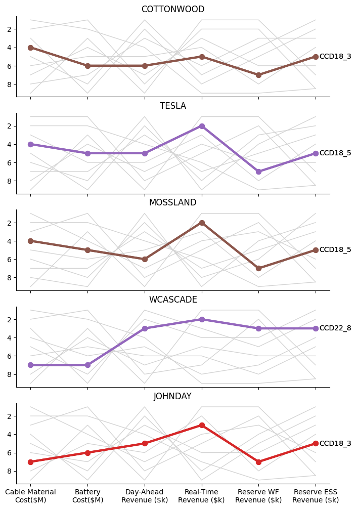
    

#### Notes:
- *CCD18_3 and CCD18_5 generalize well across multiple objectives in most locations. In WCASCADE, CCD22_8, generalize better than CCD18_3 and CCD18_5. In WCASCADE, CCD18_3 and CCD18_5 does worse on Cable Material Cost and Reserve WF Revenue.*
    * Do we expect CCD18 to average well across all objectives? Why? 

#### Scope for improvement:
- Weight assignment to objectives when ranking solutions.
- Better tie breaker when getting the generalizers.

<table border="1" class="dataframe">
  <thead>
    <tr style="text-align: right;">
      <th></th>
      <th>Cable Material Cost($M)</th>
      <th>Battery Cost($M)</th>
      <th>Day-Ahead Revenue ($k)</th>
      <th>Real-Time Revenue ($k)</th>
      <th>Reserve WF Revenue ($k)</th>
      <th>Reserve ESS Revenue ($k)</th>
    </tr>
    <tr>
      <th>Use Case</th>
      <th></th>
      <th></th>
      <th></th>
      <th></th>
      <th></th>
      <th></th>
    </tr>
  </thead>
  <tbody>
    <tr>
      <th>CCD18_3</th>
      <td>7.0</td>
      <td>6.0</td>
      <td>5.0</td>
      <td>3.0</td>
      <td>7.0</td>
      <td>5.0</td>
    </tr>
    <tr>
      <th>CCD18_5</th>
      <td>8.0</td>
      <td>5.0</td>
      <td>6.0</td>
      <td>2.0</td>
      <td>8.0</td>
      <td>4.0</td>
    </tr>
    <tr>
      <th>CCD22_8</th>
      <td>6.0</td>
      <td>7.0</td>
      <td>3.0</td>
      <td>6.0</td>
      <td>6.0</td>
      <td>3.0</td>
    </tr>
  </tbody>
</table>

### Definition-4: Best: A set of solutions that specialize in at least one objective.
A specializer here is defined as a solution which is better than the generalizer in atleast one objective function. This will usually give a set of solutions rather than a solution

    
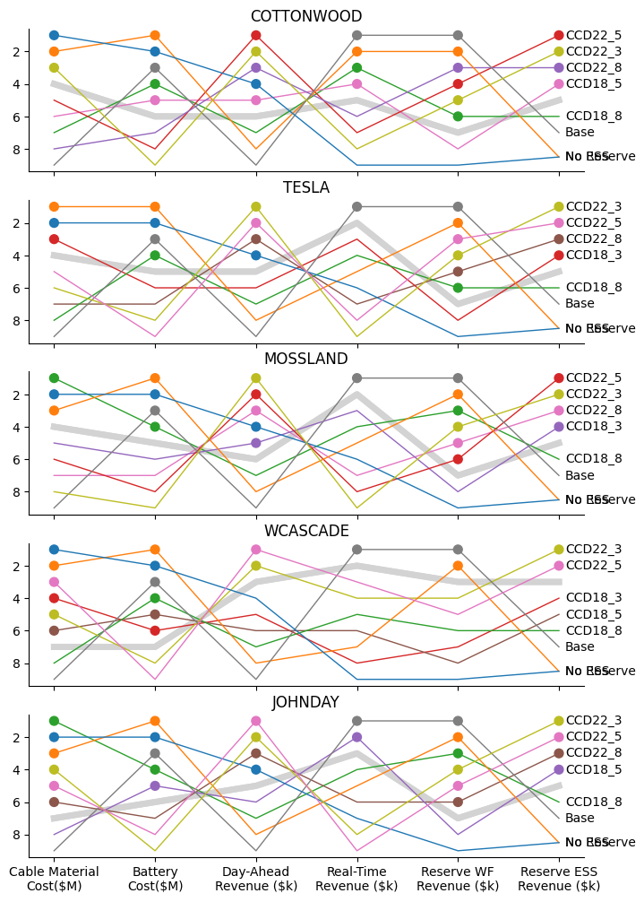
    

#### Notes:
- *You will expect multiple specializers since we are looking for solutions that specialize in at least one objective than a generalizer*
- *In most locations, a very few specializers in real-time revenue.*
- *Specializers usually do better than the generalizer in cost objectives and reserve WF revenue.*

#### Scope for improvement:
- Putting an at least limit (min_specialization) to further reduce this subset, i.e., the solution must specialize in at lease two objective functions to be in this set. 
- Minimum number of solutions to cover all objective functions. 

## Can we extend this analysis to scenarios?
- Which scenario is the best - maximize overall revenue?
- Which scenario is the worst - minimal revenue?
- Which scenarios are better for specific objectives?
- Which scenarios are better in generalising well across multiple objectives?

<table border="1" class="dataframe">
  <thead>
    <tr style="text-align: right;">
      <th></th>
      <th>Cable Capacity(MW)</th>
      <th>Battery Rated Power(MW)</th>
      <th>Cable Material Cost($M)</th>
      <th>Battery Cost($M)</th>
      <th>Day-Ahead Revenue ($k)</th>
      <th>Real-Time Revenue ($k)</th>
      <th>Reserve WF Revenue ($k)</th>
      <th>Reserve ESS Revenue ($k)</th>
    </tr>
    <tr>
      <th>sim</th>
      <th></th>
      <th></th>
      <th></th>
      <th></th>
      <th></th>
      <th></th>
      <th></th>
      <th></th>
    </tr>
  </thead>
  <tbody>
    <tr>
      <th>22</th>
      <td>2600.0</td>
      <td>36.2</td>
      <td>261.818246</td>
      <td>32.184081</td>
      <td>53.342842</td>
      <td>-11.589288</td>
      <td>0.004268</td>
      <td>0.004710</td>
    </tr>
    <tr>
      <th>23</th>
      <td>2600.0</td>
      <td>36.2</td>
      <td>261.818246</td>
      <td>32.184081</td>
      <td>53.342842</td>
      <td>-3.006324</td>
      <td>0.000850</td>
      <td>0.002057</td>
    </tr>
    <tr>
      <th>24</th>
      <td>2600.0</td>
      <td>36.2</td>
      <td>261.818246</td>
      <td>32.184081</td>
      <td>53.342842</td>
      <td>-5.214967</td>
      <td>0.001355</td>
      <td>0.001465</td>
    </tr>
    <tr>
      <th>25</th>
      <td>2600.0</td>
      <td>36.2</td>
      <td>261.818246</td>
      <td>32.184081</td>
      <td>53.342842</td>
      <td>2.644101</td>
      <td>0.000654</td>
      <td>0.000158</td>
    </tr>
    <tr>
      <th>26</th>
      <td>2600.0</td>
      <td>36.2</td>
      <td>261.818246</td>
      <td>32.184081</td>
      <td>53.342842</td>
      <td>17.872314</td>
      <td>0.023466</td>
      <td>0.004765</td>
    </tr>
    <tr>
      <th>...</th>
      <td>...</td>
      <td>...</td>
      <td>...</td>
      <td>...</td>
      <td>...</td>
      <td>...</td>
      <td>...</td>
      <td>...</td>
    </tr>
    <tr>
      <th>117</th>
      <td>2600.0</td>
      <td>36.2</td>
      <td>261.818246</td>
      <td>32.184081</td>
      <td>1.201874</td>
      <td>0.073118</td>
      <td>0.000046</td>
      <td>0.001611</td>
    </tr>
    <tr>
      <th>118</th>
      <td>2600.0</td>
      <td>36.2</td>
      <td>261.818246</td>
      <td>32.184081</td>
      <td>1.201874</td>
      <td>0.206525</td>
      <td>0.000383</td>
      <td>0.001360</td>
    </tr>
    <tr>
      <th>119</th>
      <td>2600.0</td>
      <td>36.2</td>
      <td>261.818246</td>
      <td>32.184081</td>
      <td>1.201874</td>
      <td>-0.205468</td>
      <td>0.000567</td>
      <td>0.009071</td>
    </tr>
    <tr>
      <th>120</th>
      <td>2600.0</td>
      <td>36.2</td>
      <td>261.818246</td>
      <td>32.184081</td>
      <td>1.201874</td>
      <td>-0.011400</td>
      <td>0.000079</td>
      <td>0.000552</td>
    </tr>
    <tr>
      <th>121</th>
      <td>2600.0</td>
      <td>36.2</td>
      <td>261.818246</td>
      <td>32.184081</td>
      <td>1.201874</td>
      <td>-0.033246</td>
      <td>0.000077</td>
      <td>0.000707</td>
    </tr>
  </tbody>
</table>

100 rows × 8 columns

<table border="1" class="dataframe">
  <thead>
    <tr style="text-align: right;">
      <th></th>
      <th></th>
      <th>ChS</th>
      <th>DisS</th>
      <th>SCS</th>
      <th>WPQ</th>
      <th>WSQ</th>
      <th>kBS</th>
      <th>kWS</th>
      <th>lam_DAQ</th>
      <th>lam_RT</th>
      <th>pRBDS</th>
      <th>...</th>
      <th>pWSQ</th>
      <th>v1</th>
      <th>v2</th>
      <th>WS</th>
      <th>pWDS</th>
      <th>pWS</th>
      <th>Day-Ahead Revenue ($k)</th>
      <th>Reserve ESS Revenue ($k)</th>
      <th>Reserve WF Revenue ($k)</th>
      <th>Real-Time Revenue ($k)</th>
    </tr>
    <tr>
      <th>sim</th>
      <th>time</th>
      <th></th>
      <th></th>
      <th></th>
      <th></th>
      <th></th>
      <th></th>
      <th></th>
      <th></th>
      <th></th>
      <th></th>
      <th></th>
      <th></th>
      <th></th>
      <th></th>
      <th></th>
      <th></th>
      <th></th>
      <th></th>
      <th></th>
      <th></th>
      <th></th>
    </tr>
  </thead>
  <tbody>
    <tr>
      <th rowspan="5" valign="top">22</th>
      <th>0</th>
      <td>0.005304</td>
      <td>0.002016</td>
      <td>72.400653</td>
      <td>0.000000</td>
      <td>1.631244</td>
      <td>2.0</td>
      <td>0.000000</td>
      <td>111068.493725</td>
      <td>113957.371061</td>
      <td>1.508333</td>
      <td>...</td>
      <td>0.000000</td>
      <td>475.731414</td>
      <td>475.731415</td>
      <td>1.631244</td>
      <td>750.441807</td>
      <td>0.000000</td>
      <td>1.825421</td>
      <td>2.756143e-05</td>
      <td>0.000000e+00</td>
      <td>-0.169856</td>
    </tr>
    <tr>
      <th>1</th>
      <td>0.006830</td>
      <td>0.001833</td>
      <td>72.401701</td>
      <td>0.000000</td>
      <td>1.631244</td>
      <td>2.0</td>
      <td>0.000000</td>
      <td>111068.493725</td>
      <td>111151.766882</td>
      <td>1.508333</td>
      <td>...</td>
      <td>0.000000</td>
      <td>475.729736</td>
      <td>475.729736</td>
      <td>1.631244</td>
      <td>750.441807</td>
      <td>0.000000</td>
      <td>NaN</td>
      <td>2.818572e-05</td>
      <td>0.000000e+00</td>
      <td>-0.165675</td>
    </tr>
    <tr>
      <th>2</th>
      <td>0.009288</td>
      <td>0.001677</td>
      <td>72.403353</td>
      <td>0.000000</td>
      <td>1.631244</td>
      <td>2.0</td>
      <td>0.000000</td>
      <td>111068.493725</td>
      <td>108346.162703</td>
      <td>1.508333</td>
      <td>...</td>
      <td>0.000000</td>
      <td>475.728057</td>
      <td>475.728058</td>
      <td>1.631244</td>
      <td>750.441807</td>
      <td>0.000000</td>
      <td>NaN</td>
      <td>2.881002e-05</td>
      <td>0.000000e+00</td>
      <td>-0.161494</td>
    </tr>
    <tr>
      <th>3</th>
      <td>0.013716</td>
      <td>0.001543</td>
      <td>72.406050</td>
      <td>0.000000</td>
      <td>1.631244</td>
      <td>2.0</td>
      <td>0.000000</td>
      <td>111068.493725</td>
      <td>105540.558524</td>
      <td>1.508333</td>
      <td>...</td>
      <td>0.000000</td>
      <td>475.726378</td>
      <td>475.726379</td>
      <td>1.631244</td>
      <td>750.441807</td>
      <td>0.000000</td>
      <td>NaN</td>
      <td>2.943431e-05</td>
      <td>0.000000e+00</td>
      <td>-0.157313</td>
    </tr>
    <tr>
      <th>4</th>
      <td>0.024299</td>
      <td>0.001415</td>
      <td>72.411189</td>
      <td>0.000000</td>
      <td>1.656754</td>
      <td>2.0</td>
      <td>0.000000</td>
      <td>100218.649657</td>
      <td>102734.954344</td>
      <td>1.508333</td>
      <td>...</td>
      <td>0.000000</td>
      <td>475.723523</td>
      <td>475.723523</td>
      <td>1.656754</td>
      <td>716.536060</td>
      <td>0.000000</td>
      <td>1.572685</td>
      <td>3.005861e-05</td>
      <td>0.000000e+00</td>
      <td>-0.146215</td>
    </tr>
    <tr>
      <th>...</th>
      <th>...</th>
      <td>...</td>
      <td>...</td>
      <td>...</td>
      <td>...</td>
      <td>...</td>
      <td>...</td>
      <td>...</td>
      <td>...</td>
      <td>...</td>
      <td>...</td>
      <td>...</td>
      <td>...</td>
      <td>...</td>
      <td>...</td>
      <td>...</td>
      <td>...</td>
      <td>...</td>
      <td>...</td>
      <td>...</td>
      <td>...</td>
      <td>...</td>
    </tr>
    <tr>
      <th rowspan="5" valign="top">121</th>
      <th>91</th>
      <td>0.057586</td>
      <td>0.181982</td>
      <td>0.138868</td>
      <td>1.143338</td>
      <td>2.831317</td>
      <td>2.0</td>
      <td>0.006317</td>
      <td>163680.830824</td>
      <td>134271.586201</td>
      <td>1.508333</td>
      <td>...</td>
      <td>1.093234</td>
      <td>480.217598</td>
      <td>480.212294</td>
      <td>2.831317</td>
      <td>43.235001</td>
      <td>1.093234</td>
      <td>NaN</td>
      <td>5.802918e-07</td>
      <td>1.807893e-09</td>
      <td>-0.000421</td>
    </tr>
    <tr>
      <th>92</th>
      <td>0.094833</td>
      <td>0.116952</td>
      <td>0.128312</td>
      <td>0.000000</td>
      <td>2.741472</td>
      <td>2.0</td>
      <td>0.000000</td>
      <td>148412.687808</td>
      <td>131484.129416</td>
      <td>1.508333</td>
      <td>...</td>
      <td>0.000000</td>
      <td>475.671659</td>
      <td>475.671675</td>
      <td>2.741472</td>
      <td>4.894323</td>
      <td>0.000000</td>
      <td>0.003889</td>
      <td>8.794077e-08</td>
      <td>0.000000e+00</td>
      <td>-0.000048</td>
    </tr>
    <tr>
      <th>93</th>
      <td>0.087642</td>
      <td>0.137289</td>
      <td>0.110534</td>
      <td>0.000000</td>
      <td>2.741472</td>
      <td>2.0</td>
      <td>0.000000</td>
      <td>148412.687808</td>
      <td>130878.298467</td>
      <td>1.508333</td>
      <td>...</td>
      <td>0.000000</td>
      <td>475.671371</td>
      <td>475.671388</td>
      <td>2.741472</td>
      <td>4.894323</td>
      <td>0.000000</td>
      <td>NaN</td>
      <td>4.331705e-08</td>
      <td>0.000000e+00</td>
      <td>-0.000047</td>
    </tr>
    <tr>
      <th>94</th>
      <td>0.080859</td>
      <td>0.173926</td>
      <td>0.081147</td>
      <td>0.000000</td>
      <td>2.741472</td>
      <td>2.0</td>
      <td>0.000000</td>
      <td>148412.687808</td>
      <td>130272.467519</td>
      <td>1.508333</td>
      <td>...</td>
      <td>0.000000</td>
      <td>475.671202</td>
      <td>475.671220</td>
      <td>2.741472</td>
      <td>4.894323</td>
      <td>0.000000</td>
      <td>NaN</td>
      <td>-1.306666e-09</td>
      <td>0.000000e+00</td>
      <td>-0.000047</td>
    </tr>
    <tr>
      <th>95</th>
      <td>0.073323</td>
      <td>0.286643</td>
      <td>0.019080</td>
      <td>0.000000</td>
      <td>2.741472</td>
      <td>2.0</td>
      <td>0.000000</td>
      <td>148412.687808</td>
      <td>129666.636570</td>
      <td>1.508333</td>
      <td>...</td>
      <td>0.000000</td>
      <td>475.670965</td>
      <td>475.670985</td>
      <td>2.741472</td>
      <td>4.894323</td>
      <td>0.000000</td>
      <td>NaN</td>
      <td>-4.593039e-08</td>
      <td>0.000000e+00</td>
      <td>-0.000045</td>
    </tr>
  </tbody>
</table>

9600 rows × 25 columns

### Which scenario is the best - maximizing total revenue (sum of objective functions)
In which scenario, do we maximize the total revenue? Total revenue is computed by summing up revenue across all the revenue related objective functions. 

<table border="1" class="dataframe">
  <thead>
    <tr style="text-align: right;">
      <th></th>
      <th>count</th>
      <th>mean</th>
      <th>std</th>
      <th>min</th>
      <th>25%</th>
      <th>50%</th>
      <th>75%</th>
      <th>max</th>
      <th>selected_solution</th>
    </tr>
  </thead>
  <tbody>
    <tr>
      <th>Day-Ahead Revenue ($k)</th>
      <td>100.0</td>
      <td>52.037997</td>
      <td>32.823280</td>
      <td>1.201874</td>
      <td>26.837089</td>
      <td>52.842652</td>
      <td>68.323501</td>
      <td>136.196299</td>
      <td>136.196299</td>
    </tr>
    <tr>
      <th>Real-Time Revenue ($k)</th>
      <td>100.0</td>
      <td>0.290401</td>
      <td>6.120973</td>
      <td>-17.387559</td>
      <td>-3.025179</td>
      <td>1.139057</td>
      <td>4.716428</td>
      <td>17.872314</td>
      <td>10.871624</td>
    </tr>
    <tr>
      <th>Reserve WF Revenue ($k)</th>
      <td>100.0</td>
      <td>0.025298</td>
      <td>0.026578</td>
      <td>0.000046</td>
      <td>0.005135</td>
      <td>0.018360</td>
      <td>0.040850</td>
      <td>0.186279</td>
      <td>0.078170</td>
    </tr>
    <tr>
      <th>Reserve ESS Revenue ($k)</th>
      <td>100.0</td>
      <td>0.007385</td>
      <td>0.005302</td>
      <td>0.000125</td>
      <td>0.003399</td>
      <td>0.006763</td>
      <td>0.010169</td>
      <td>0.038544</td>
      <td>0.015887</td>
    </tr>
  </tbody>
</table>

    

    

#### Notes:
- Since day-ahead revenue is the biggest component, the scenario with maximum day-ahead revenue is selected.
- Other revenues are also in the top quartile of the distribution.
- It seems like a windy day with high DA and RT prices.

### Which scenario is the worst - minimal revenue?
In which scenario, do we get minimum total revenue? Total revenue is computed by summing up revenue across all the revenue related objective functions.

<table border="1" class="dataframe">
  <thead>
    <tr style="text-align: right;">
      <th></th>
      <th>count</th>
      <th>mean</th>
      <th>std</th>
      <th>min</th>
      <th>25%</th>
      <th>50%</th>
      <th>75%</th>
      <th>max</th>
      <th>selected_solution</th>
    </tr>
  </thead>
  <tbody>
    <tr>
      <th>Day-Ahead Revenue ($k)</th>
      <td>100.0</td>
      <td>52.037997</td>
      <td>32.823280</td>
      <td>1.201874</td>
      <td>26.837089</td>
      <td>52.842652</td>
      <td>68.323501</td>
      <td>136.196299</td>
      <td>1.201874</td>
    </tr>
    <tr>
      <th>Real-Time Revenue ($k)</th>
      <td>100.0</td>
      <td>0.290401</td>
      <td>6.120973</td>
      <td>-17.387559</td>
      <td>-3.025179</td>
      <td>1.139057</td>
      <td>4.716428</td>
      <td>17.872314</td>
      <td>-0.205468</td>
    </tr>
    <tr>
      <th>Reserve WF Revenue ($k)</th>
      <td>100.0</td>
      <td>0.025298</td>
      <td>0.026578</td>
      <td>0.000046</td>
      <td>0.005135</td>
      <td>0.018360</td>
      <td>0.040850</td>
      <td>0.186279</td>
      <td>0.000567</td>
    </tr>
    <tr>
      <th>Reserve ESS Revenue ($k)</th>
      <td>100.0</td>
      <td>0.007385</td>
      <td>0.005302</td>
      <td>0.000125</td>
      <td>0.003399</td>
      <td>0.006763</td>
      <td>0.010169</td>
      <td>0.038544</td>
      <td>0.009071</td>
    </tr>
  </tbody>
</table>

    
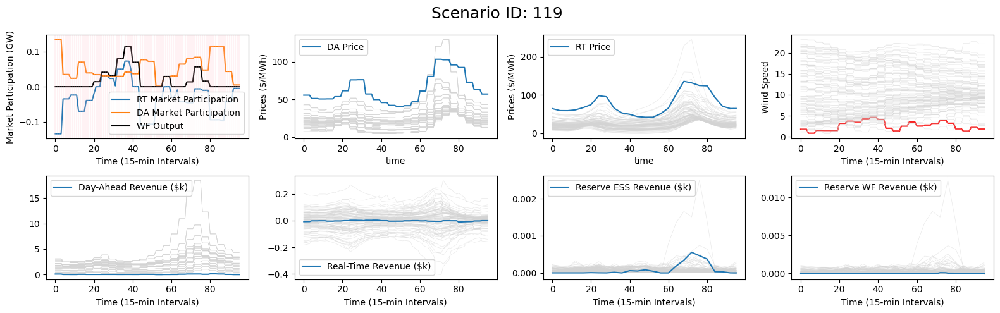
    

#### Notes:
- Since day-ahead revenue is the biggest component, the scenario with minimum day-ahead revenue is selected.
- Real-time revenue though is in middle quartile of the distribution.
- The day seems to be least windy even though the DA and RT prices are high.

### In which scenario, the solution is generalizing well across multiple objectives?
To account for uncertainty and variation in conditions, the optimization considers 100 scenarios - a combination of 20 wind conditions and 5 day-ahead market price condition. Can we identify the scenario where the given solution generalize well across multiple objectives

    
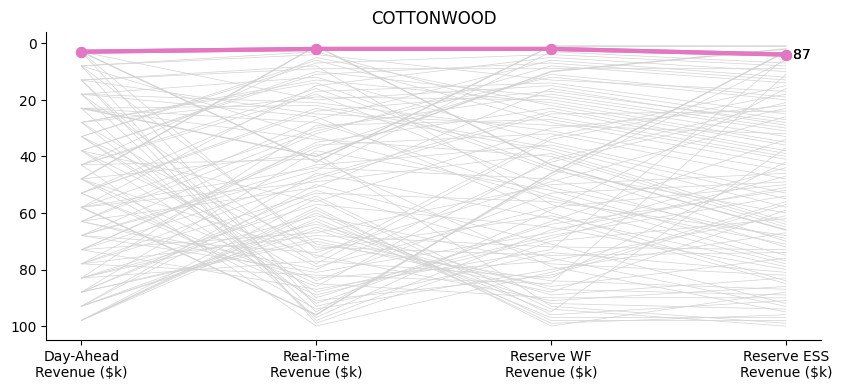
    

    

    

#### Notes:
- The generalizer is the scenario in which we maximized the total revenue.
- The worst ranking of this scenario is better than any other scenario. 

### In which set of scenarios, the solution is specialising over the generalizer?
To account for uncertainty and variation in conditions, the optimisation considers 100 scenarios - a combination of 20 wind conditions and 5 day-ahead market price conditions. Can we identify scenarios where the given solution is better than the generalizer in at least one objective function?

    Text(0.5, 1.0, 'COTTONWOOD')

    
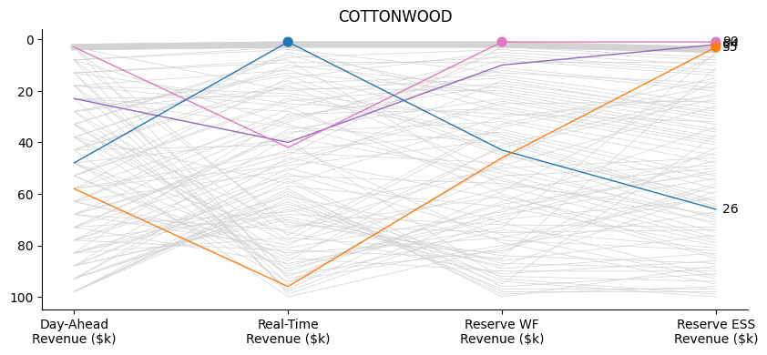
    

    
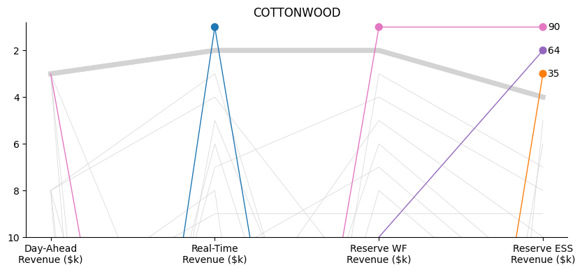
    

    
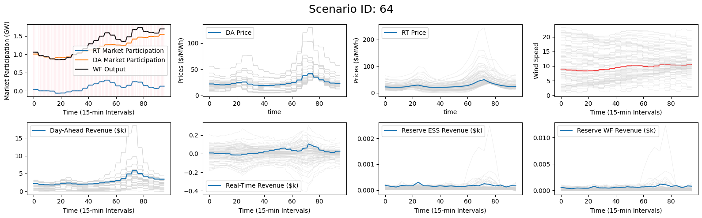
    

    
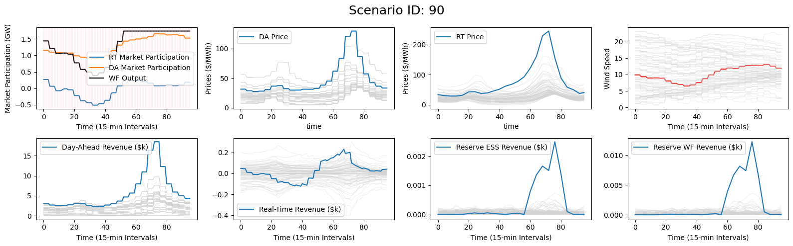
    

    
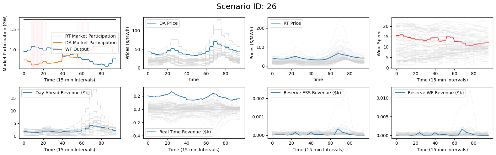
    

    
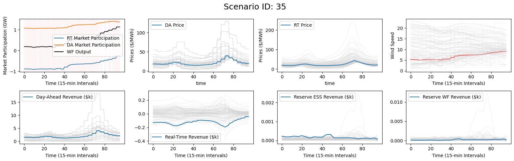
    

### How many more such scenarios exist?

    Index(['ChS', 'DisS', 'SCS', 'WPQ', 'WSQ', 'kBS', 'kWS', 'lam_DAQ', 'lam_RT',
           'pRBDS', 'pRBUS', 'pRWDS', 'pRWUS', 'pWDSQ', 'pWRS', 'pWSQ', 'v1', 'v2',
           'WS', 'pWDS', 'pWS', 'Day-Ahead Revenue ($k)',
           'Reserve ESS Revenue ($k)', 'Reserve WF Revenue ($k)',
           'Real-Time Revenue ($k)'],
          dtype='object')

    Top 10 time series closest to '87':
    1. 52 — DTW distance: 7.0018
    2. 26 — DTW distance: 7.2071
    3. 45 — DTW distance: 7.8973
    4. 38 — DTW distance: 7.9266
    5. 116 — DTW distance: 8.5960
    6. 69 — DTW distance: 8.6162
    7. 63 — DTW distance: 9.9562
    8. 81 — DTW distance: 11.5841
    9. 96 — DTW distance: 11.6684
    10. 36 — DTW distance: 12.3031

    
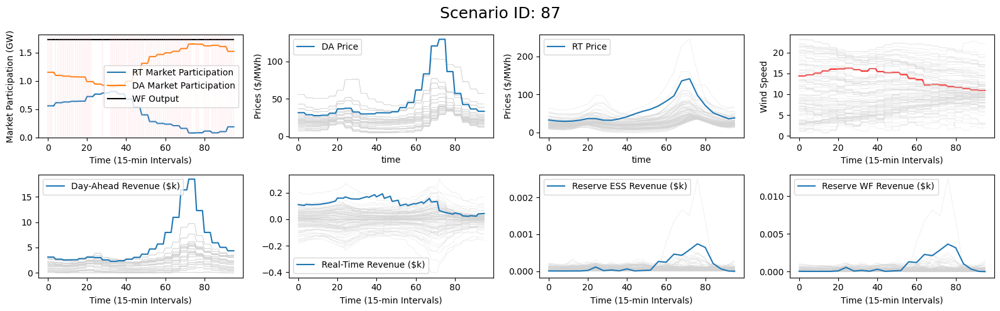
    

    
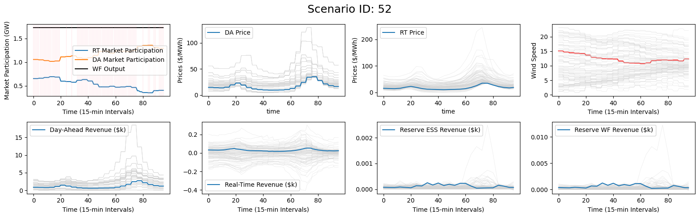
    

## Univariate Time Series Clustering

    Index(['ChS', 'DisS', 'SCS', 'WPQ', 'WSQ', 'kBS', 'kWS', 'lam_DAQ', 'lam_RT',
           'pRBDS', 'pRBUS', 'pRWDS', 'pRWUS', 'pWDSQ', 'pWRS', 'pWSQ', 'v1', 'v2',
           'WS', 'pWDS', 'pWS', 'Day-Ahead Revenue ($k)',
           'Reserve ESS Revenue ($k)', 'Reserve WF Revenue ($k)',
           'Real-Time Revenue ($k)'],
          dtype='object')

### By Wind Speed

    /Users/jain432/Library/CloudStorage/OneDrive-PNNL/Milan/Workspace/PNNL Projects/pyMOODS/venv/pymoods_mac/lib/python3.13/site-packages/sklearn/utils/deprecation.py:151: FutureWarning: 'force_all_finite' was renamed to 'ensure_all_finite' in 1.6 and will be removed in 1.8.
      warnings.warn(
    /Users/jain432/Library/CloudStorage/OneDrive-PNNL/Milan/Workspace/PNNL Projects/pyMOODS/venv/pymoods_mac/lib/python3.13/site-packages/sklearn/utils/deprecation.py:151: FutureWarning: 'force_all_finite' was renamed to 'ensure_all_finite' in 1.6 and will be removed in 1.8.
      warnings.warn(

    
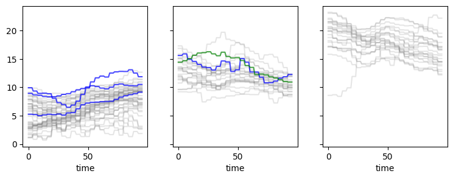
    

#### Notes:
- Clustering identifying different types of wind conditions - some clusters can be merged together. 

### By Day Ahead Revenue

    /Users/jain432/Library/CloudStorage/OneDrive-PNNL/Milan/Workspace/PNNL Projects/pyMOODS/venv/pymoods_mac/lib/python3.13/site-packages/sklearn/utils/deprecation.py:151: FutureWarning: 'force_all_finite' was renamed to 'ensure_all_finite' in 1.6 and will be removed in 1.8.
      warnings.warn(
    /Users/jain432/Library/CloudStorage/OneDrive-PNNL/Milan/Workspace/PNNL Projects/pyMOODS/venv/pymoods_mac/lib/python3.13/site-packages/sklearn/utils/deprecation.py:151: FutureWarning: 'force_all_finite' was renamed to 'ensure_all_finite' in 1.6 and will be removed in 1.8.
      warnings.warn(

    
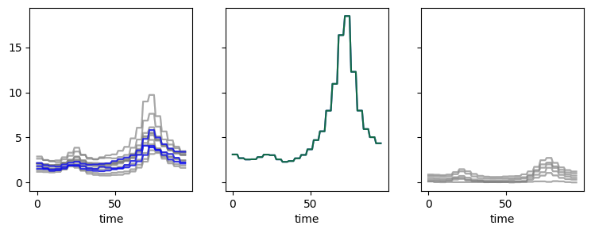
    

## Multivariate Timeseries Clustering

    /Users/jain432/Library/CloudStorage/OneDrive-PNNL/Milan/Workspace/PNNL Projects/pyMOODS/venv/pymoods_mac/lib/python3.13/site-packages/sklearn/utils/deprecation.py:151: FutureWarning: 'force_all_finite' was renamed to 'ensure_all_finite' in 1.6 and will be removed in 1.8.
      warnings.warn(
    /Users/jain432/Library/CloudStorage/OneDrive-PNNL/Milan/Workspace/PNNL Projects/pyMOODS/venv/pymoods_mac/lib/python3.13/site-packages/sklearn/utils/deprecation.py:151: FutureWarning: 'force_all_finite' was renamed to 'ensure_all_finite' in 1.6 and will be removed in 1.8.
      warnings.warn(

    
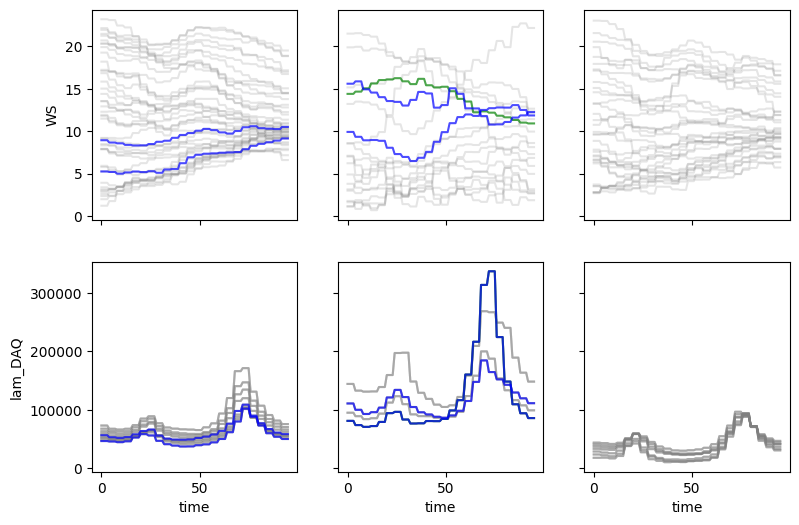
    

#### Notes:
- lam_DAQ - because of the scale - is driving the clustering
